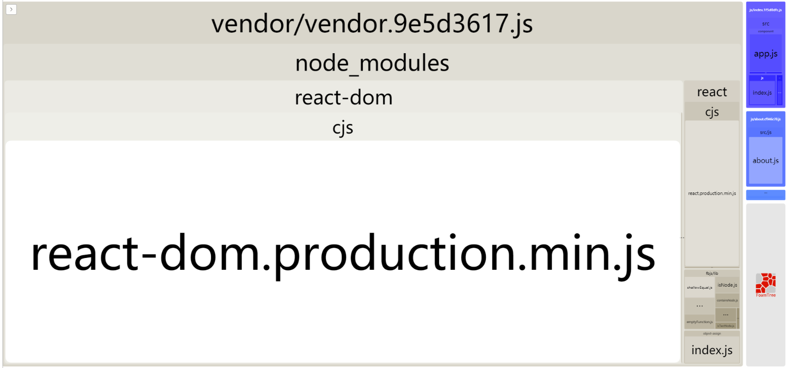

## 路径相关 paths.js

根据 `/src/view/(*).html` 确定入口 `{(*):/src/js/(*).js}`。
如需添加 `cdn` ，在 `package.js` 添加 `{homepage: 'https://your-cdn-url'}` 字段。

webpack 在多页面，按需引入还没有好的解决方案 可能要手动设置



## tree

```powershell
+---config                     # 配置文件
+---dist                       # 生产目录
|   +---commons                # 多次引用
|   +---css                    #
        +---index.xxx.css      # A 入口文件样式
|   +---js                     #
        +---index.xxx.js       # A minJS
        +---about.xxx.js       # B minJS
|   +---static                 # 静态资源
|   \---vendor                 # node_modules 库文件
\---src                        # 开发目录
    +---component              # React 组件
        +---app.js             #
        +---app.css            #
    +---img                    #
        +---1.jpg              #
    +---js                     #
        +---index.js           # 入口文件 A
        +---about.js           # 入口文件 B
    +---lib                    # 第三方库
        +---jq.js
    \---view                   # 视图模板
        +---index.html         # 对应入口文件 A
        +---about.html         # 对应入口文件 B
+---.babelrc                   # babel config
+---.gitignore                 # git ignore
+---index.html
+---LICENSE
+---package.json
+---postcss.config.js
+---README.md
+---yarn.lock
```

```javascript
// Paths Config
// 对应生产 ${appBuild}/*html
entryAppHtml: getAppHtmlEntry("./src/view/*.html"),
// 添加多入口
appEntry: resolveAppEntry({
    index: "src/js/index.js",
    about: "src/js/about.js"
  }),
```
